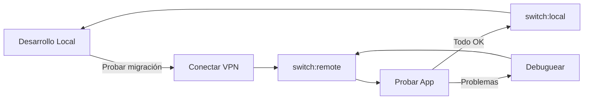

# 📋 Guía de Configuración: Cambio entre Base de Datos Local y Remota

## 🎯 Objetivo
Esta guía te permite cambiar fácilmente entre tu base de datos SQL Server local y la base de datos remota en el servidor para probar la migración.

---

## 📁 Archivos Creados

- **`.env.local.backup`** → Tu configuración local original (respaldo seguro)
- **`.env.remote`** → Configuración para el servidor remoto (debes completar)
- **`.env`** → Archivo activo que usa la aplicación
- **`switch-to-remote.bat`** → Script para cambiar a configuración remota
- **`switch-to-local.bat`** → Script para volver a configuración local

---

## 🚀 Paso a Paso

### 1️⃣ Completar Datos del Servidor Remoto

Edita el archivo **`.env.remote`** y completa estos datos:

```env
DB_HOST=              # IP o nombre del servidor (ej: 192.168.1.100)
DB_PORT=1433          # Puerto (usualmente 1433 para remoto)
DB_USER=              # Usuario SQL Server del servidor
DB_PASSWORD=          # Contraseña del usuario
DB_NAME=taskmanagementsystem  # Nombre de la BD (ya completado)
```

**Datos que necesitas del administrador del servidor:**
- 📍 IP o nombre del servidor SQL Server
- 👤 Usuario SQL Server (con permisos sobre la BD)
- 🔑 Contraseña del usuario
- 🔢 Puerto (normalmente 1433, pero puede variar)

---

### 2️⃣ Conectarse a la VPN

**IMPORTANTE:** Antes de usar la configuración remota, asegúrate de:
✅ Estar conectado a la VPN de tu empresa/servidor
✅ Tener acceso de red al servidor SQL Server

---

### 3️⃣ Cambiar a Configuración Remota

**Opción A: Usando scripts batch (Recomendado)**
```bash
# Doble clic en:
switch-to-remote.bat
```

**Opción B: Usando comandos npm**
```bash
npm run switch:remote
```

**Opción C: Manualmente**
```bash
copy .env.remote .env
```

---

### 4️⃣ Iniciar la Aplicación

```bash
npm start
```

La aplicación ahora se conectará a la base de datos **REMOTA** en el servidor.

---

### 5️⃣ Probar la Conexión

Verifica en la consola que aparezcan estos mensajes:
```
✅ Pool conectado a SQL Server
✅ Pool de conexiones creado exitosamente
🚀 Sistema de base de datos inicializado
```

Si ves errores de conexión:
- ❌ Verifica que estés conectado a la VPN
- ❌ Verifica los datos en `.env.remote`
- ❌ Verifica que el firewall permita la conexión al puerto SQL Server

---

### 6️⃣ Volver a Configuración Local

Cuando termines de probar, vuelve a tu configuración local:

**Opción A: Usando scripts batch (Recomendado)**
```bash
# Doble clic en:
switch-to-local.bat
```

**Opción B: Usando comandos npm**
```bash
npm run switch:local
```

**Opción C: Manualmente**
```bash
copy .env.local.backup .env
```

---

## 🔍 Verificar Configuración Actual

Para ver qué configuración está activa:

```bash
npm run show:config
```

O simplemente abre el archivo `.env`

---

## ⚠️ Consideraciones Importantes

### 🔒 Seguridad
- **NO** subas el archivo `.env.remote` con contraseñas a Git
- Los archivos `.env*` ya están en `.gitignore`
- Mantén las contraseñas seguras

### 🔄 Diferencias entre Local y Remoto

| Aspecto | Local | Remoto |
|---------|-------|--------|
| Host | `GUSLAPTOP\SQLEXPRESS` | IP del servidor |
| Puerto | `60167` (dinámico) | `1433` (estándar) |
| Requiere VPN | ❌ No | ✅ Sí |
| Versión SQL | SQL Server 2016 | SQL Server 2013 |

### 🐛 Solución de Problemas

**Error: "Connection is closed"**
- Verifica que estés en la VPN
- Reinicia la aplicación con `npm start`

**Error: "Login failed for user"**
- Verifica usuario y contraseña en `.env.remote`
- Confirma que el usuario tiene permisos en la BD

**Error: "Cannot connect to server"**
- Verifica la IP/nombre del servidor
- Verifica el puerto (usualmente 1433)
- Verifica que el firewall permita la conexión

---

## 🎯 Flujo de Trabajo Recomendado



---

## 📞 Comandos Rápidos

```bash
# Ver configuración actual
npm run show:config

# Cambiar a remoto
npm run switch:remote

# Cambiar a local
npm run switch:local

# Iniciar aplicación
npm start
```

---

## ✅ Checklist de Prueba

Cuando pruebes con la BD remota, verifica:

- [ ] La aplicación inicia sin errores
- [ ] Puedes hacer login
- [ ] Se muestran las tareas existentes
- [ ] Puedes crear nuevas tareas
- [ ] Puedes editar tareas
- [ ] Puedes eliminar tareas
- [ ] Los filtros funcionan correctamente
- [ ] Las búsquedas retornan resultados
- [ ] Los reportes se generan correctamente

---

## 💡 Tip Pro

Puedes mantener dos terminales abiertas:
- Terminal 1: Configuración local para desarrollo
- Terminal 2: Configuración remota para pruebas

Solo cambia la configuración en cada terminal según necesites.

---

**¿Problemas?** Revisa los logs de la consola y verifica la conexión VPN primero.
